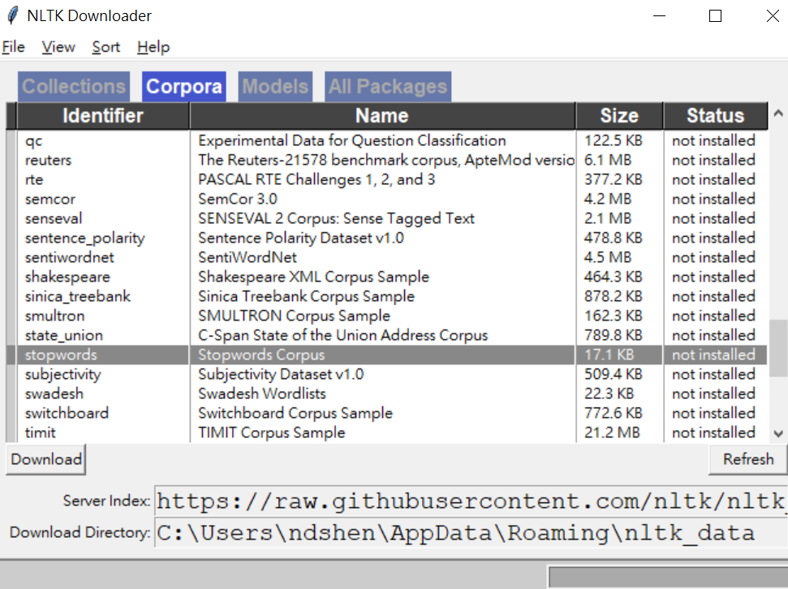

# Extract Terms

## Description
This script the first homework for the **Introduction to Information Retrieval and Text Mining** course.   
It's main purpose is to extract terms from a English document.

## Usage
#### Step1
Make sure that you've already install `python3` on your computer.   
If not, you can download it [here](https://www.python.org/downloads/).   

#### Step2
This script uses package `nltk`, which stands for **Natural Language Toolkit**, and will not be in your python environment when you first download.
Run the following command in your terminal to download it.   
```pip install nltk```   

#### Step3
After you download the `nltk` package, run the python shell and type in the following scripts.   

```
import nltk
nltk.download()
```   
A new window should open, showing the NLTK Downloader. Download the **stopwords**.   
   

#### Step4
Now you are ready to go, run the script and the result will be stored in a new text file.
```python extract_terms.py```   


